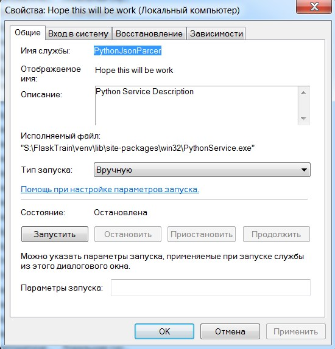
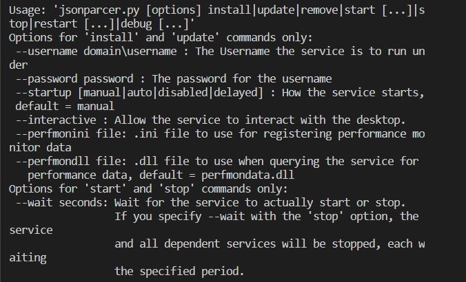
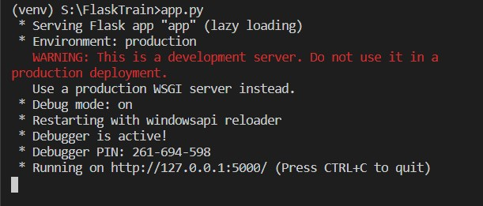
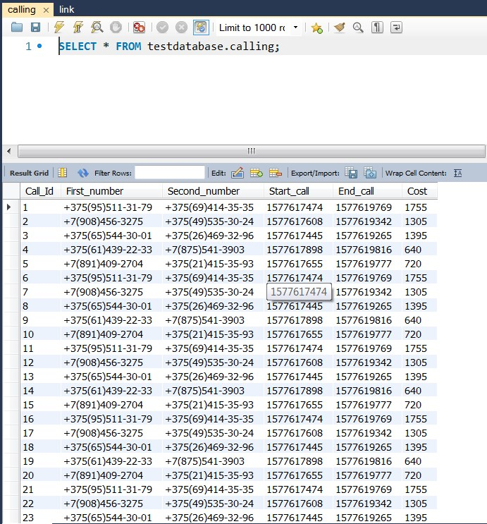
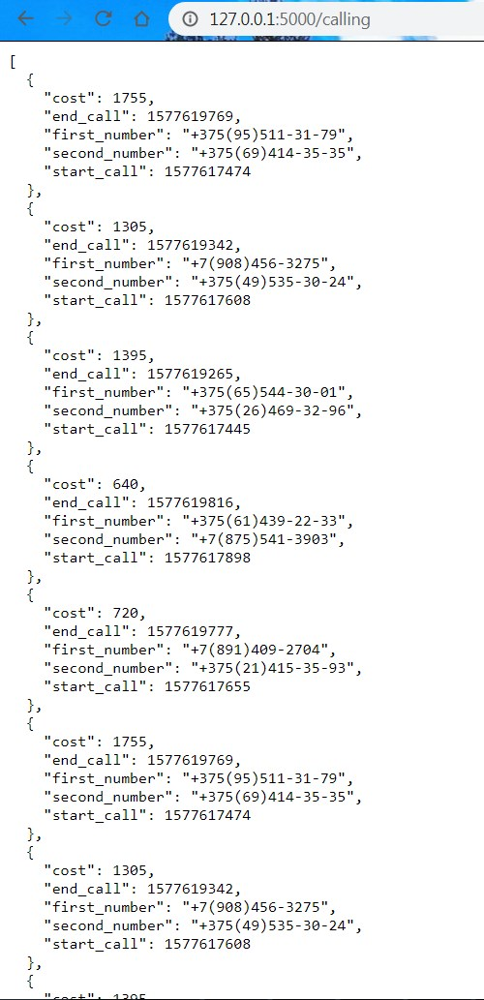
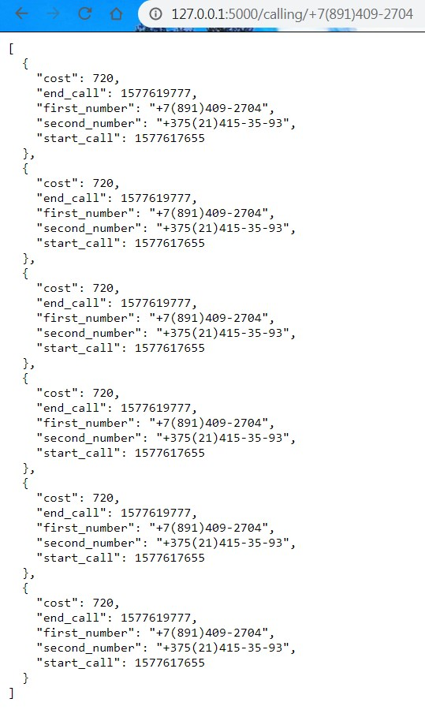

# JSON-Parser-EDI
This is a simple Python/Flask application intended to provide a working example of Windows Service and simple Flask REST API with GET method request.

There is a folder. JSON files gradually appear in the folder. The call objectin the file with the following fields: number of the person who called (line), number of the person who called (line), start time of the call (Unix timest),end time of the call (-/-), type of connection(line, one of (GSM, CDMA, LTE)).

There is a DB. Two entities: tariff plan and call. The tariff plan consistsof the following attributes: type of connection and price per minute ofconversation (in indivisible units, for example, in coins, it can just bea positive integer). A call consists of the following 
attributes: number of the person who called, number of the person who called, time of the startof the call, time of the end of the call, cost of the call.

Task: write a service (EDI) that monitors how call files appear in thedirectory. As soon as a file with a call appears, he reads it, parses it,calculates the cost for the corresponding type of connection and writes it tothe database and, if everything is ok with the record, the file is deleted.

In addition, there is a simple REST API with one method:
* GET / call with a parametric number, which returns all calls (2 numbers, start / end time, cost), in which the number from the
parameter participated (there are both incoming and outgoing). Take data from the database. Data Format: JSON

## Getting Started

These instructions will get you a copy of the project up and running on your local machine for development and testing purposes. 
See deployment for notes on how to deploy the project on a live system.

### Preparations

What things you need to install the software and how to install them
```sh
  $ # Pre-installed Python 3 and MySQL Database Workench
  $ # Create new Python virtual environment (<venv>)
  $ # Clone the repository to get the example code:
  $ git clone https://github.com/ZotovPhill/JSON-Parser-EDI.git
  $ # Install all dependencies inside virtual environment.
  $ pip install --user --requirement requirements.txt
  $ # Make changes in config.ini file, set up connection to your MySQL database.
  $ # Write down Path to directiry where JSON files appears. 
  $ # Also make sure you set up path to log file and file for collecting bad formatted records

  ```

### Installing

A step by step series of examples that tell you how to get a development env running

* 0. Make sure you have successfully completed all points of preparations
* 1. Open a command prompt, navigate to your script directory and install the service with the command:
```
  $ python jsonparcer.py install
```
* 2. Make sure Service installed. Open Windows Service Manager and found "PythonJsonParcer" in list of services



*WARNING Make sure you specify the user with the appropriate rights to start the service

* 3. Open MySQL Workbench Client and Log in, make sure you have already created table of Tariff before you started the service, name it "link". Let the database console opened. 

* 4. In command prompt, navigate to your script directory and start the service with the command. Service working in background, parsing files from directory specified in the configuration file and all subdirectories and only of .json format. For additional details of working service look in .log file. If you have any problems during running service take a look at "If Something goes wrong..."

```
  $ python jsonparcer.py start
```
* Tip: Below is a complete list of available commands for the service, parameters are case sensitive



* 5. Flask REST API represented by a script app.py. For running application just navigate to your script directory and run in it through command promt. Application establishes a connection to database and, you can pass GET request for taking values form database and serialize to JSON format 



Example of getting some data out of the system:







### And coding style

Using flake8 plugin for validating Python code style with the command line code formatting tool black. 
Black, “The Uncompromising Code Formatter”, is normally run to edit Python code in place to match their coding style, 
a strict subset of the PEP 8 style guide.

```
  $ pip install flake8-black
```

## If something goes wrong…
There are a couple of known problems that can happen writing Windows Services in Python. 
If you have successfully installed the service but starting it you get an error, follow this iter to troubleshoot your service:
```sh
  $ #Check if Python is in your PATH variable. It MUST be there. 
  $ # Be sure to have the file 
  $ <venv>\Python3x\Lib\site-packages\win32\pywintypes3x.dll 
  $ # If you don’t have this file, take it from 
  $ <venv>\Python3x\Lib\site-packages\pywin32_system32\pywintypes3x.dll 
  $ # And copy it into 
  $ <venv>\Python3x\Lib\site-packages\win32
```
If you still have problems, try executing your Python script in debug mode. To try this open a terminal, navigate to the directory where the script resides and type
```
  $ python jsonparcer.py debug
```
## Built With

* [Python 3](https://www.python.org/) - The Main Programming Language
* [MySQL 8.0](https://www.mysql.com/) - Relational DBMS
* [Flask (1.1.x)](http://flask.palletsprojects.com/en/1.1.x/) - REST API framework
* [SQLAlchemy / Marshmallow](https://marshmallow-sqlalchemy.readthedocs.io/en/latest/) - SQLAlchemy integration with the marshmallow 
(de)serialization library

## Authors

* **Phill Zotov** - *Initial work* - [Also My Repository](https://github.com/ZotovPhill/Training_Repo)

## Acknowledgments

* Hat tip to anyone whose code was used
* Special thanks to Google and Stack for solving problems
* etc
